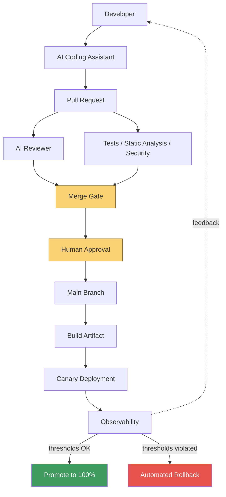

# AI Production Pipeline

A reference architecture for shipping AI-assisted code to production
safely: AI writes it, AI reviews it, deterministic systems verify it,
canary deployment and monitoring catch what slips through, and a human
makes the final call at every point that matters.

[](.github/workflows/ci.yml)
[](.github/workflows/security.yml)
[](.github/workflows/ai-review.yml)

## Why This Exists

AI-generated software increases development speed but can also increase
unseen technical debt — code that looks correct, passes a quick glance, and
ships a subtle business-logic bug, a race condition, or a missing
authorization check. This project demonstrates a production workflow
designed to preserve that speed while keeping the engineering controls that
catch what a fast glance misses: layered automated review, deterministic
quality gates, progressive delivery, observability, and a human who remains
accountable for what actually ships.

It's a small, real, runnable FastAPI service plus the full CI/CD and
governance scaffolding around it — not a tutorial, and not a claim that
every piece is running in a real cloud (see [What is real vs.
simulated](docs/architecture.md#what-is-real-vs-simulated-in-this-repo)).

## Architecture



Full write-up: [docs/architecture.md](docs/architecture.md).

## Pipeline

1. **AI-assisted development** — an engineer uses an AI coding assistant to
   write the change.
2. **Pull request** — the change is opened as a PR with the [required
   template](.github/pull_request_template.md) forcing the author to state
   what could break and how to roll it back.
3. **AI architectural review** — [`ai-review.yml`](.github/workflows/ai-review.yml)
   runs an LLM against the diff using [`prompts/code-review.md`](prompts/code-review.md),
   focused on business logic, security, reliability, and performance —
   never formatting or style. See [docs/ai-review-strategy.md](docs/ai-review-strategy.md).
4. **Automated testing** — unit, integration, and negative/error-path tests
   ([`ci.yml`](.github/workflows/ci.yml)), with a coverage floor.
5. **Security scanning** — Bandit, pip-audit, and configuration checks
   ([`security.yml`](.github/workflows/security.yml)). See [docs/threat-model.md](docs/threat-model.md).
6. **Merge gate** — every check above must pass; CRITICAL/HIGH AI findings
   block merge, MEDIUM and below are informational.
7. **Human approval** — a required reviewer, independent of every automated
   check. See [ADR-004](docs/adr/004-human-remains-final-decision-maker.md).
8. **Canary release** — [`deploy.yml`](.github/workflows/deploy.yml) ships
   to a small traffic slice first. See [docs/deployment-strategy.md](docs/deployment-strategy.md).
9. **Production monitoring** — structured logs + Prometheus-style metrics
   on the four golden signals.
10. **Rollback / promotion** — [`scripts/canary_analysis.py`](scripts/canary_analysis.py)
    compares canary against baseline and decides automatically.
11. **Continuous improvement** — incidents feed back into tests, the AI
    reviewer's prompt, and monitoring. See [Feedback Loop](#feedback-loop).

## Defense in Depth

**No single check in this pipeline is trusted as authoritative.** A clean
AI review doesn't skip tests. Passing tests don't skip security scans. All
of the above don't skip human approval. A healthy canary doesn't mean the
next one will be. Each layer covers what the others structurally can't:

| Layer | Catches | Can't catch |
|---|---|---|
| Ruff / mypy | Formatting, type errors | Whether the logic is *correct* |
| Bandit / pip-audit | Known vulnerability patterns, CVEs | Business-logic or authorization bugs |
| **AI reviewer** | Contextual issues (missing auth check, bad state transition) | Reliably, every time — it's probabilistic ([ADR-001](docs/adr/001-ai-review-is-not-authoritative.md)) |
| Tests | Regressions in covered paths | Anything not covered, by definition |
| Canary + monitoring | Issues that only appear under real production traffic | Anything before it ships to *some* traffic |
| **Human approval** | Business context, risk judgment, accountability | Doesn't scale to review every line at the speed AI writes it — this is why the other layers exist |

> *"AI writes the code. AI reviews the code. Deterministic systems verify
> the code. Humans make the final decision."*

## AI Review Strategy

Review is performed by [`blackstalk/ai-review-action`](https://github.com/blackstalk/ai-review-action),
a standalone, stack-agnostic GitHub Action — this repo's
[`ai-review.yml`](.github/workflows/ai-review.yml) just calls it, passing
its own customized prompt ([`prompts/code-review.md`](prompts/code-review.md)).
Extracting review logic into a shared action means the same reviewer is
usable from any repo, in any language, with one `uses:` line — see
[ADR-005](docs/adr/005-ai-review-is-a-shared-versioned-action.md).

The reviewer is instructed to **ignore** formatting, naming preference, and
anything deterministic tooling already owns, and to **prioritize**:

- **Business logic** — incorrect assumptions, bad state transitions, missing
  validation, race conditions
- **Security** — injection, auth bypass, IDOR, insecure defaults, SSRF,
  secrets exposure
- **Reliability** — unhandled exceptions, missing timeouts/retries, resource
  leaks, weak failure handling
- **Performance** — N+1 queries, unbounded loops, unnecessary network calls

Findings are severity-classified (CRITICAL → INFORMATIONAL) with file, line,
explanation, production impact, and a concrete remediation — see the schema
in [`prompts/code-review.md`](prompts/code-review.md). Changes touching auth,
payments, personal data, deletions, migrations, or secrets are treated as
higher severity by default.

Five intentionally vulnerable snippets in [`examples/`](examples/) (SQL
injection, missing authorization, N+1 query, swallowed exception, unsafe
delete) exist specifically to smoke-test this reviewer — see
[examples/README.md](examples/README.md). **None of them are imported by the
running application**; a test (`tests/security/test_examples_are_isolated.py`)
enforces that in CI.

## Running Locally

```bash
make install   # create a venv and install the app + dev tooling
make test      # run the full test suite with coverage
make run       # start the API on http://localhost:8000
```

Try it:

```bash
curl -s -X POST http://localhost:8000/api/items \
  -H 'content-type: application/json' \
  -d '{"name": "Widget", "price_cents": 1999, "quantity": 3}' | python3 -m json.tool

curl -s http://localhost:8000/api/items | python3 -m json.tool
curl -s http://localhost:8000/metrics | head -20
```

Interactive API docs: `http://localhost:8000/docs`.

Run everything CI would run before a PR merges:

```bash
make ci   # ruff + mypy + pytest + bandit + pip-audit
```

Simulate the full canary deployment locally (stable + canary containers
behind a weighted nginx router, scraped by Prometheus) — requires Docker
Desktop (or another local Docker daemon) running:

```bash
make docker-canary   # docker compose up --build
python3 scripts/canary_analysis.py --prometheus-url http://localhost:9090
```

## CI/CD

| Workflow | Runs on | Requires secrets? | What it does |
|---|---|---|---|
| [`ci.yml`](.github/workflows/ci.yml) | every PR, push to `main` | No | ruff, mypy, pytest + coverage, Docker build validation |
| [`security.yml`](.github/workflows/security.yml) | every PR, push to `main`, weekly | No | Bandit, pip-audit, unsafe-config checks, secret-scanning guidance |
| [`ai-review.yml`](.github/workflows/ai-review.yml) | every PR | Yes — `ANTHROPIC_API_KEY`, skips gracefully if unset | Calls [`blackstalk/ai-review-action`](https://github.com/blackstalk/ai-review-action); posts findings as a PR comment, fails on CRITICAL/HIGH |
| [`deploy.yml`](.github/workflows/deploy.yml) | push to `main` (after merge) | No (simulated deploy target) | Build artifact → canary deploy → observe → promote/rollback |

## Canary Strategy

```text
Build artifact → Deploy canary (5% traffic) → Observe metrics
  → Compare against stable baseline → Promote to 100% OR Rollback
```

Implemented with real Docker containers, a real nginx weighted router, and a
real local Prometheus — see [docs/deployment-strategy.md](docs/deployment-strategy.md)
for the full mechanics, the rollback thresholds, and a table mapping every
step onto Kubernetes, AWS ECS, Lambda aliases, and API Gateway/service mesh
equivalents.

## Feedback Loop

```text
Production incident → root cause analysis → new test
  → updated AI reviewer prompt → new monitoring rule
  → updated engineering standard → (back into development)
```

An incident that reaches production despite every layer above is itself
information: it means either a check didn't cover this case, or a human
judged wrong. The response is never just "fix the bug" — it's asking which
layer should have caught this and closing that gap: a regression test if
tests missed it, an addition to [`prompts/code-review.md`](prompts/code-review.md)
if the AI reviewer's instructions didn't cover the pattern, a new alert
threshold if monitoring didn't surface it fast enough.

## ML Systems Extension

The same pipeline — deterministic validation, AI-assisted review, canary
delivery, observability, human accountability — extends to machine learning
systems with additional stages (data validation, training, model evaluation,
model registry, shadow/canary inference) and ML-specific checks (schema
validation, drift detection, training-serving skew, evaluation thresholds).
Documented in full, without building a full ML platform: [docs/ml-extension.md](docs/ml-extension.md).

## Repository Structure

```text
app/            FastAPI service: api/ core/ models/ services/ repositories/
tests/          unit/ integration/ security/
scripts/        canary_analysis.py
prompts/        code-review.md — the AI reviewer's system prompt
examples/       intentionally vulnerable snippets, isolated from app/
docs/           architecture, AI review strategy, deployment, threat model, ML extension
docs/adr/       architectural decision records
deploy/canary/  nginx weighted router + Prometheus config for the local canary demo
.github/        workflows, PR template, CODEOWNERS
```

## Future Enhancements

This repo intentionally stays runnable without paid services or real cloud
infrastructure. A fork aimed at production would add:

- Kubernetes (or Argo Rollouts / Flagger) for real canary traffic shifting
- Terraform for the infrastructure this repo currently simulates in Docker Compose
- OpenTelemetry for distributed tracing across services
- Grafana dashboards on top of the existing Prometheus metrics
- A real cloud deployment target (ECS, EKS, or Lambda)
- MLflow / a model registry, feature store, and drift detection for the
  [ML extension](docs/ml-extension.md)
- Automated model retraining triggered by the monitoring signals described there

## License

[MIT](LICENSE)
