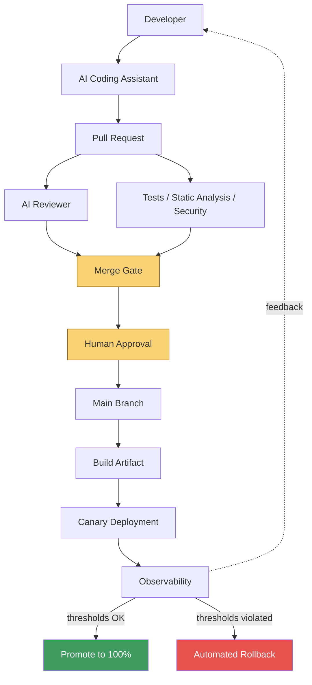

# Architecture

## Application

A small FastAPI service (`app/`) with a conventional layered structure:

```text
app/
├── api/            HTTP boundary: request/response, status codes, dependency wiring
├── core/           Cross-cutting concerns: config, logging, metrics, error types
├── models/         Pydantic schemas — validation lives at the boundary
├── services/       Business logic, transport-agnostic (no FastAPI imports)
├── repositories/   Persistence, hidden behind a narrow interface
└── main.py         Wiring: middleware, routers, exception handling
```

The layering exists for one reason: **the AI reviewer and a human reviewer
both need to find business logic without wading through HTTP or persistence
concerns.** `app/services/item_service.py` is where "incorrect state
transition" or "missing validation" bugs would actually live; it imports
nothing from FastAPI, so it's also trivially unit-testable without spinning
up a server (see `tests/unit/`).

`ItemRepository` (`app/repositories/item_repository.py`) is in-memory,
guarded by a lock for thread safety. It is explicitly a **reference
implementation** — swapping it for Postgres via SQLAlchemy, or DynamoDB,
changes nothing in `services/` or `api/`, because both depend on the
repository's public interface, not its implementation.

## Why integer cents, not floats, for price

`price_cents: int` in `app/models/item.py` rather than `price: float` is a
deliberate choice, not an oversight — floating-point currency arithmetic
accumulates rounding error. This is exactly the kind of "incorrect
assumption" the AI reviewer is instructed to look for in business logic; it
exists here partly to be a clear-air example of the pattern.

## Observability wiring

`app/main.py` installs one middleware that does three things per request:

1. Assigns (or propagates) a request ID via a `ContextVar`, so every log
   line emitted during that request — from any layer — carries it.
2. Records the golden-signal metrics (`http_requests_total`,
   `http_errors_total`, `http_request_duration_seconds`) exposed at
   `GET /metrics` in Prometheus text format.
3. Emits one structured JSON access log line per request.

See [production monitoring in deployment-strategy.md](deployment-strategy.md#production-monitoring)
for how these map to the canary promote/rollback decision.

## The pipeline this repo demonstrates



Every arrow into `Gate` is independent: a passing AI review does not skip
deterministic checks, and passing deterministic checks does not skip human
approval. See [ADR-001](adr/001-ai-review-is-not-authoritative.md) and the
README's "Defense in Depth" section for why.

## What is real vs. simulated in this repo

Being upfront about this is part of the point — claiming a portfolio project
is "production-ready" when pieces are simulated would undermine the exact
kind of engineering honesty this repo is trying to demonstrate.

| Component | Status |
|---|---|
| FastAPI app, tests, structured logging, metrics | Real, runnable |
| ruff / mypy / Bandit / pip-audit | Real, runnable, wired into CI |
| `ci.yml`, `security.yml` | Real GitHub Actions, no secrets required |
| `ai-review.yml` | Real workflow; delegates to [`blackstalk-labs/ai-review-action`](https://github.com/blackstalk-labs/ai-review-action), which calls the live Anthropic API when `ANTHROPIC_API_KEY` is set, skips gracefully otherwise |
| Canary deployment (`docker-compose.yml`, nginx `split_clients`) | Real, runs locally; a **reference pattern** for what a cloud load balancer / service mesh / K8s controller would do, not a production controller itself |
| `scripts/canary_analysis.py` | Real logic against a real local Prometheus; the promote/rollback thresholds are illustrative |
| `deploy.yml` "production" deployment | Simulated — deploys to the workflow runner itself, not a cloud environment. Documented as a **reference implementation** of the sequence, not a cloud deployment |

## Extending to real infrastructure

See [deployment-strategy.md](deployment-strategy.md) for how each simulated
piece maps onto Kubernetes, AWS ECS, Lambda aliases, API Gateway, or a
service mesh.
