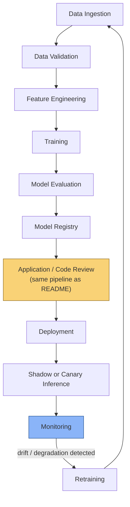

# ML Systems Extension

This repository ships a conventional service, deliberately, because the
pipeline principle — deterministic validation + AI-assisted review +
progressive delivery + observability + human accountability — is the
interesting part, and a CRUD service is the smallest thing that can carry
it. This document describes how the *same* pipeline extends to a machine
learning system, without building one, because the extension points are
what would actually get reused.

## Extended pipeline

The loop closes at `Retrain → Data`, the same shape as the feedback loop in
the main pipeline (production incident → root cause → improved system). A
model degrading in production is this domain's version of an incident.

## Where the code pipeline plugs in unchanged

`Model Registry → Application/Code Review → Deployment` is the exact
pipeline this repo already implements: the code that *serves* a model (the
inference endpoint, feature-fetching logic, pre/post-processing) goes
through the same AI review, deterministic tests, security scan, merge gate,
and human approval as any other change. Nothing about "it's ML" exempts
serving code from `prompts/code-review.md`'s reliability and performance
checks — a missing timeout on a feature store call is the same bug whether
the endpoint returns a `price_cents` or a model prediction.

What's new is everything **before** that point (data → registry) and one
addition **after** it (shadow/canary inference needs ML-specific comparison
metrics, not just HTTP error rate).

## ML-specific checks, by stage

### Data ingestion & validation

- **Schema validation** — column types, required fields, allowed value
  ranges (the ML analogue of this repo's pydantic boundary validation in
  `app/models/item.py`)
- **Missing values** — rate of nulls per feature, with a threshold that
  fails the pipeline if exceeded
- **Distribution drift (input)** — is today's ingested data statistically
  different from the training distribution? (e.g. population stability
  index, KS test)
- **Feature freshness** — is a feature's source data as recent as the
  system assumes? (a stale feature silently degrades predictions without
  ever throwing an exception — the ML equivalent of this repo's "swallowed
  exception" example)

### Feature engineering & training

- **Data leakage** — does any feature encode information that wouldn't be
  available at inference time (e.g. a label-derived feature, or a
  timestamp that leaks future data into a training row)?
- **Training-serving skew** — is the feature computed identically in the
  training pipeline and the serving path? Mismatched logic here is a
  silent correctness bug with no stack trace, structurally similar to this
  repo's "incorrect assumption" business-logic category

### Model evaluation

- **Evaluation thresholds** — a model doesn't get promoted to the registry
  unless it clears a fixed metric bar (accuracy/AUC/F1/business metric)
  against a held-out set — the ML analogue of this repo's coverage
  threshold (`--cov-fail-under=85` in `pyproject.toml`)
- **Slice-level evaluation** — aggregate metrics can hide a model that
  regressed badly on one subgroup; evaluate on meaningful slices, not just
  overall

### Model registry

- **Model versioning** — every promoted model is immutable and traceable
  to the exact training data, code commit, and hyperparameters that
  produced it — the ML analogue of a Docker image tagged with a git SHA
  (`deploy.yml` tags images `ai-production-pipeline:${{ github.sha }}`)

### Deployment: shadow or canary inference

- **Shadow mode** — the new model runs alongside the current one on live
  traffic, its predictions logged but never served to users, so its
  behavior on real data can be compared before it's ever in the loop. This
  has no direct analogue in the app pipeline (there's no equivalent of
  "run the new code path silently") and is one of the genuinely
  ML-specific tools
- **Canary inference** — same mechanism as `docs/deployment-strategy.md`'s
  canary deployment (small % of traffic, compare against baseline,
  promote/rollback), but the comparison metric is prediction quality, not
  HTTP error rate

### Monitoring & retraining triggers

- **Concept drift** — the relationship between features and the target
  changes over time, even if the input distribution hasn't (the model's
  assumptions about the world become wrong)
- **Data drift** — the input distribution itself changes (covered above,
  but also monitored continuously in production, not just at ingestion)
- **Inference latency** — the same p95/p99 latency signal as
  `docs/deployment-strategy.md`, tracked per model version
- **Prediction quality** — proxy metrics if ground truth is delayed (e.g. a
  fraud model won't know it was wrong for days), true metrics once labels
  arrive

Any of these crossing a threshold triggers retraining — closing the loop
back to data ingestion, the same way an incident closes the loop back to
engineering in the main pipeline's feedback loop section.

## What this repo does not build, and why

A full ML platform (feature store, training orchestrator, model registry
service, drift-detection pipeline) is out of scope for a reference
architecture repo — each of those is a multi-week project on its own, and
building a shallow, non-functional version of each would demonstrate less
than clearly documenting the extension points does. The "Future
Enhancements" section of the [README](../README.md) lists MLflow, a feature
store, and drift detection as concrete next steps for a fork of this repo
that does want to build one.
